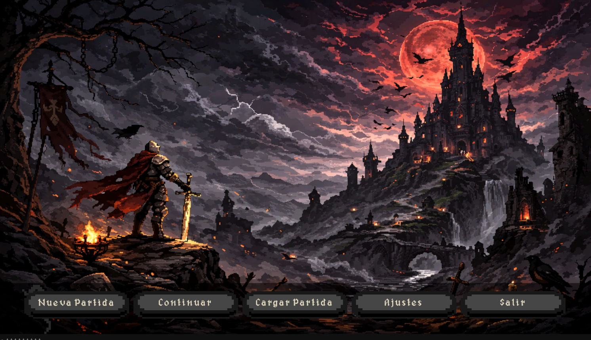
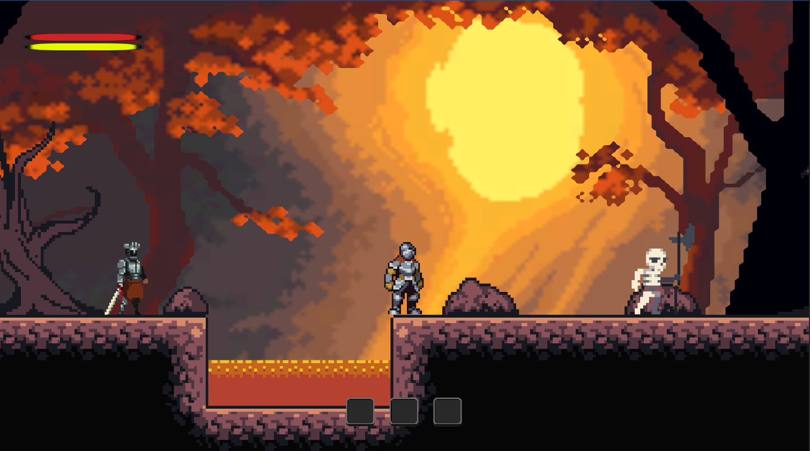
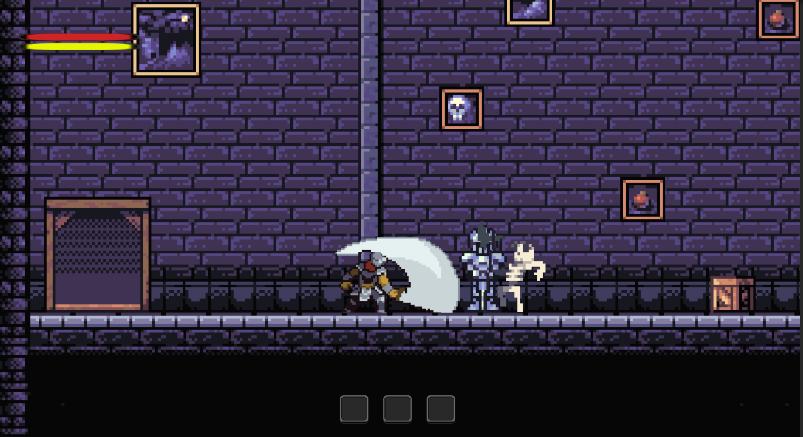
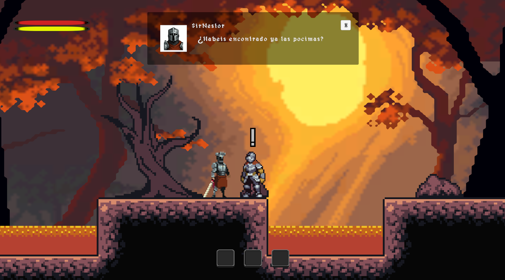
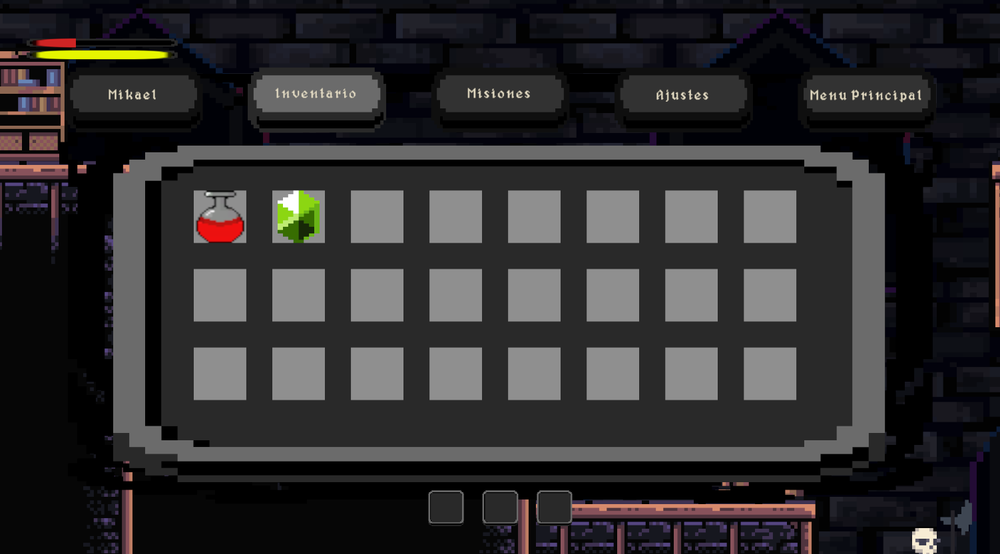
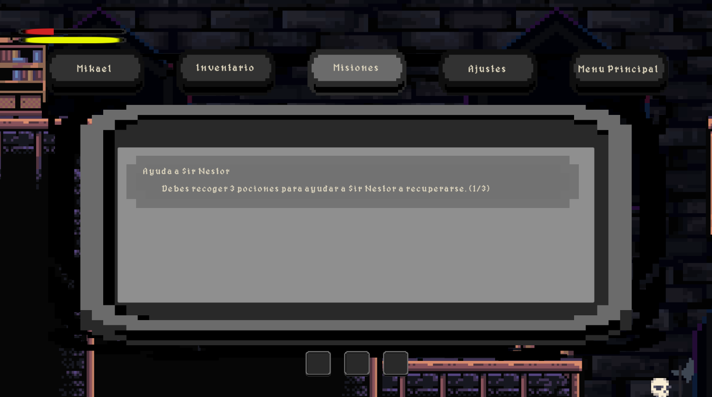

# ⚔️ Ashes of Myrkul

## 🎮 About the project

**Ashes of Myrkul** is a 2D gothic medieval metroidvania developed with Unity and C# as my final project for the Higher Degree in Multiplatform Application Development (DAM).

The game features exploration, combat mechanics, progression systems and a dark fantasy pixel art atmosphere inspired by classic metroidvania games.

## 📸 Screenshots

### Main Menu

### Gameplay

### Combat System

### Dialogue System

### Inventory System

### Quest System

## ✨ Features

- 🗺️ 5 playable levels
- ⚔️ Combat system
- ❤️ Health and damage system
- 👹 Enemy behaviour system
- 💬 NPC dialogue system
- 📜 Quest system
- 🎒 Inventory system
- 💾 Save and load system
- 📦 Chest and item system
- 🎵 Music and sound effects
- 🎮 Main menu and settings

## 🛠️ Technologies Used

## 🧩 Main Systems

### Player System
Player movement, jumping and combat interactions.

### Save System
Persistent game data management allowing players to continue their progress.

### Quest System
Mission system with objectives, NPC interactions, NPC dialogue progress and progress tracking.

### Inventory System
Item collection and management system integrated with gameplay mechanics.

## 📚 What I learned

During the development of this project I improved my knowledge in:

- Object Oriented Programming
- Game architecture
- Unity development workflow
- Database integration
- Problem solving
- Project organization

## 👤 Developer

Created by Carlos Ponce Santana
